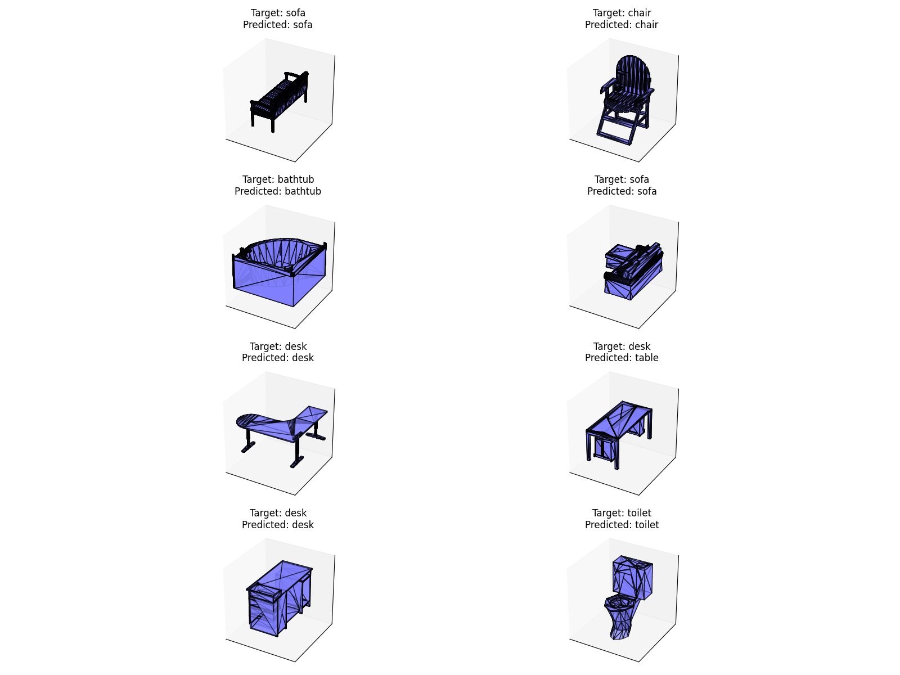

## PointNet

Implementation of the [PointNet: Deep Learning on Point Sets for 3D Classification and Segmentation](https://arxiv.org/abs/1612.00593) paper for shape classification on [Modelnet10](https://modelnet.cs.princeton.edu/)

### Instruction to set up ModelNet-10/40 dataset

> Data Folder

This is the recommended folder structure for organizing the `ModelNet10` dataset for PointNet-based training or evaluation.

```
pointnet/
└── data/
    └── ModelNet10/                  
        ├── ModelNet10/                
        ├── bathtub/               
        ├── bed/
        ├── chair/
        ├── desk/
        ├── dresser/
        ├── monitor/
        ├── night_stand/
        ├── sofa/
        ├── table/
        └── toilet/
```

> Each category (e.g., `chair`, `table`) contains `train/` and `test/` folders with `.off` files representing 3D CAD models.

> Download link
1. Download the official ModelNet10 dataset from [Princeton ModelNet](https://modelnet.cs.princeton.edu/).
2. Extract it and place the contents as instructed above.

### Model Training

Before training the model create two folders to save model checkpoints namely ```checkpoints``` to save checkpoints for vanilla pointnet model and ```checkpoints_pp``` to save checkpoints for pointnet++ model. These checkpoints will be required to test the model performance.

> Train PointNet
```bash
python3 train.py --model_name pointnet --num_epochs 30
```

> Train PointNet++
```bash
python3 train.py --model_name pointnet++ --num_epochs 30
```

### Model Testing

> Test PointNet
```bash
python3 test.py --model_name pointnet --checkpoint_path path/to/model/checkpoint.pth
```

> Test PointNet++
```bash
python3 test.py --model_name pointnet++ --checkpoint_path path/to/model/checkpoint.pth
```

> Prediction Outputs


*Figure: 1 - Pointnet Predictions*



*Figure: 2 - Pointnet++ Predcitions*